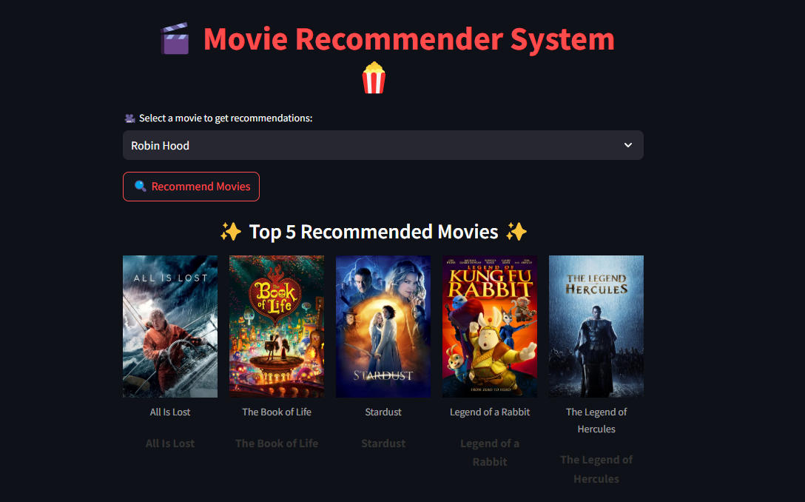

# Movie-Recomendation-System
This project is a Content-Based Movie Recommendation System built using Python and Machine Learning techniques. It suggests English movies based on the similarity of content features such as movie genres, keywords, and overviews. This system is ideal for providing personalized recommendations without requiring user ratings.

# Features
1. Content-Based Filtering: Recommends movies similar to a user-selected movie by analyzing movie metadata (genres, cast, crew, and keywords).
2. Text Vectorization: Uses TF-IDF Vectorization or Count Vectorization to transform text data into a format suitable for similarity computation.
3. Cosine Similarity: Computes similarity scores to rank and recommend the most relevant movies.

# Dataset
A public dataset, such as TMDB 5000 Movie Dataset, containing metadata for English-language movies, including titles, genres, keywords, and movie overviews.

# How It Works
1. Data Preprocessing: Cleans and prepares movie data, extracting key features like genres, cast, and keywords.
2. Text Vectorization: Converts textual data into numeric vectors using Count Vectorization.
3. Similarity Computation: Uses Cosine Similarity to find movies similar to a user’s input.
4. Recommendation Generation: Displays a list of similar movies.

# Images


# Installation and Usage
1. Clone this repository:
  ```
  git clone https://github.com/yourusername/movie-recommendation-system
  cd movie-recommendation-system
  ```

2. Install the required libraries:
   ```
   pip install -r requirements.txt
   ```

# Future Enhancements
1. Add multi-criteria filtering using user ratings.
2. Expand recommendations to include director-based or actor-based filtering.
3. Integrate a user interface with frameworks like Streamlit or Flask.

# Contributions
Contributions are welcome! Feel free to fork the repository and submit pull requests.
